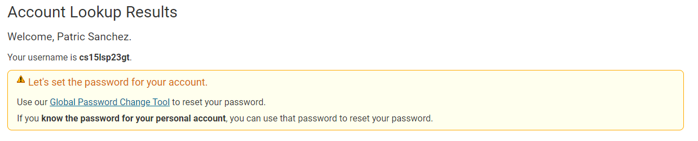
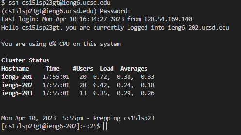
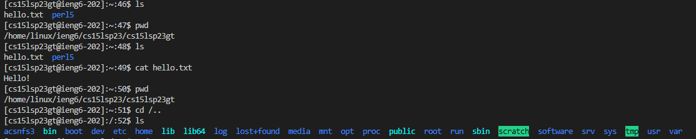
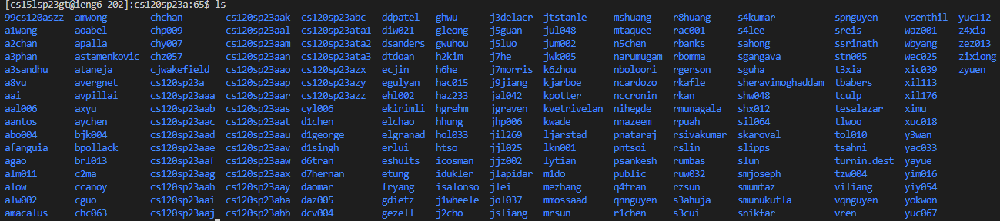

# How to Use Remote Access in CSE15L

## Downloading VSCode
One of the preliminary skillsets of this course is to use remote access in the terminal so that you can utilize the resources of an external computer other than your own. In order to do this, the very first step to set-up this process is to install VScode on your own device. VSCode is a popular programming IDE that we will use the terminal to connect via remote access. 

Download the correct version of VScode according to your computer's operating system at the following link: [https://code.visualstudio.com/](https://code.visualstudio.com/). Upon downloading and opening the application, you should be prompted with a similiar looking screen if not welcome messages.


*Note: Depending on your system preferences, VScode may appear as white or dark mode. I set VScode to be in dark mode, but as long as VScode has a similar layout, you are all set up with VScode.*

## Setting up your UCSD CSE15L account
The next step is to reset your password on your own CSE15L account given to you by UCSD. The following process can be access at: [https://sdacs.ucsd.edu/~icc/index.php](https://sdacs.ucsd.edu/~icc/index.php).
Put in your UCSD username (typically the first part of your UCSD email) and PID. You will be prompted with an "Account Lookup Results" page, where you will want to find your cs15l account. Mine was listed under Additional Accounts. This will show you your username. **Be sure to take note of your username.** Under your listed username, click the button *Global Password Change Tool* to reset your account password. Since this is the first time you are using this account, you need to make a password. 



**Note: This username and password are seperate from your TritonLink account. When entering in the username of the account to resest your password, ensure that you use your cs15l account and NOT your TritonLink username. Resetting your password sometimes happens immediately and other times can take up to over an hour. If it's not working immediately, please be patient. **

## Remotely Connecting

Once you have reset your password, now we can use the terminal in VScode to finally use remote access. If you have a windows device, you will need to download git if you have not done so previously. This can be found at [https://git-scm.com/](https://git-scm.com/). 

At the top of the VSCode terminal, go to the terminal tab to **New Terminal.** When this terminal is open, on the right side, make sure that the terminal you are using is under bash, which uses _Git Bash_. For example, if you are using windows the default terminal will be powershell. Click the little arrow next to the plus sign on the terminal tab to make a new _Git Bash terminal_. Input the following command, replacing the first part before the "@" with your own cs15l username. The following command is an example of a command using my username to use remote access.
```
$ ssh cs15lsp23gt@ieng6.ucsd.edu
```

If this is successful, you should be greeted with a prompt asking a yes/no question. Type in _yes_ and you will be asked to enter in your password. Reminder: enter in your cs15l password that you created earlier with the password reset tool. A successful login should look somewhat similiar to the following output in the terminal: 



_Note: When entering your password, you will not be shown what you are typing, essenially looking like you are not typing anything. This is a security measure and not a bug. Even though it doesn't show you, you will still need to type in your password into the terminal asking for your cs15l's username._ 

# Remote Access
Congragulations! You are now using remote access to connect to a computer in the CSE basement. Any commands that you put in your terminal will be run on that external computer rather than your own. Here are some commands that I found cool to use upon first use of remote access that demonstrate access the file system of another computer: 
 


_This last image appears to show what I believe student accounts in CSE120. By navigating to the directory ieng6, you can see all of the directories that each represent a class. Your class will also have its own directory with student accounts enrolled, you included!_

All in all, I hope you found this tutorial useful and everything went as expected. There will always be unexpeted problems that come up, so please don't be discouraged when an error or problem occurs. Good luck and have fun!
