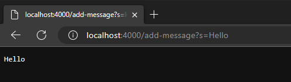

# Lab Report 2

## Part 1
**Code for StringServer**


**First request for StringServer**


* When using `/add-message?s=Hello` the handleRequest method is called. `.getpath()` and `.equals("add/message")` are used in a conditional statement in order to determine if a certain condition is met. In the above instance, this is the case so the conditional is true. `.getQuery().split("=)` is then run to get the user input to concatenate to the web page
* Relevant arguments to the methods are "/add-message" as this is the way the program checks to see if the url is structured correctly. If it is, checked through a conditional, then the query from `.getQuery()` can be split and concatenated to the web page. Another important argument is the URI type argument of the handleRequest method that takes in the url of the webpage. This holds core functionality such that the rest of the methods are able to run. 
* The main determining value that is relevant to the above screenshot is the query of the URL. When `/add-message?s=Hello` was added to the URL, the relevant methods mentioned before determined what the string value should be. In this case, "Hello" was the string value. With this information, the string value then was concatenated to the webpage, which was originally empty. 

**Second request for StringServer**


* Similiar to the previous screenshot of Hello, the same methods are being run. 
* The same overall arguments are being provided to the methods, but in this case the url is different. The query part of the url contains a different value, `s=How are you` that will then be used and concatenated to the running string.
* Being the second iteration of the program, the string value to be concatenated is different. Since the url in this screenshot is `/add-message?s=How are you` the string value that the handlRequest method returns is the running string concatenated with this new string value. In this case, "Hello" is saved as the string, then "How are you" is concatenated on another line on the webpage.

## Part 2
The bug that I will be discussing for this part is the bug found in the reversed method 

* JUnit test that induces a failure using the reversed method:
```
@Test
public void testReversed() {
  int[] input = {1, 2, 3, 4, 5};
  assertArrayEquals(new int[] {5, 4, 3, 2, 1}, ArrayExamples.reversed(input));
}
```

* JUnit test that doesn't induce a failure using the reversed method:

```
@Test
public void testReversed2() {
  int[] input = { };
  assertArrayEquals(new int[] { }, ArrayExamples.reversed(input));
}
```
* Output in terminal demonstrating buggy implementation of reversed method: 


* Before code change: buggy method implementation
```
  static int[] reversed(int[] arr) {
    int[] newArray = new int[arr.length];
    for(int i = 0; i < arr.length; i += 1) {
      arr[i] = newArray[arr.length - i - 1];
    }
    return arr;
  }
```
After code change: fixed method implementation:
```
 static int[] reversed(int[] arr) {
   int[] newArray = new int[arr.length];
   for(int i = 0; i < arr.length; i += 1) {
     //assignment has been revered so newArray holds the reversed array
     newArray[i] = arr[arr.length - i - 1];
   }
   //should return newArray
   return newArray;
 }
```
In the buggy implementation of the reversed method, the main issue at hand was `arr[i] = newArray[arr.length - i - 1];`
The method is supposed to return a new array that possessed the reversed order of the original array, yet what this line is doing is the complete opposite. Since arr[i] is on the left hand side, the original array is being overwritten. Even though newArray was initialized, it is never being used. Additionally, in the return statement, the original array is being returned and _not_ a new array.

To fix this, the array assignment line on the left hand side uses newArray indexes, so the newly created array is being filled in with the elements of the original array in reversed order. Lastly, change the return statement to make it return newArray.

## Part 3
One thing I learned these past two weeks in lab was working with servers to host a web page. This is something that never crossed my mind before, but during lab 2 I learned how to create and host a web page, and the general background structure of how it works. Contrary to this web page that uses markdown and GitHub Pages, the numerous web pages we create were established using Java. We actually coded logic programs such as StringServer that use Java to manipulate the web page, which can solely be done using the URL.
