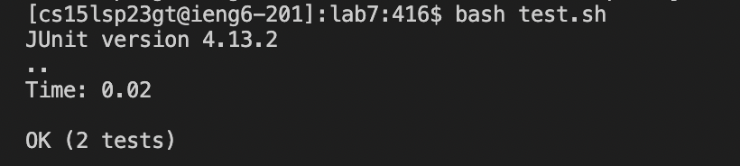
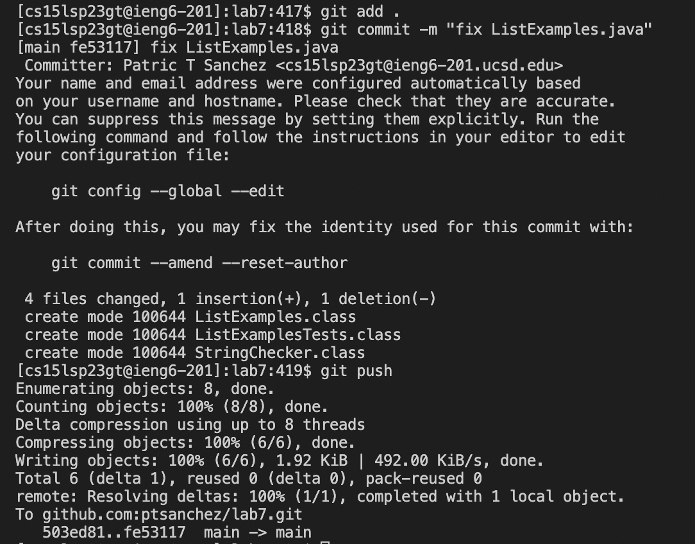

# Lab Report 4

## Step 4:
The first step to reproduce the task is to login into ieng6. This is straighforward enough, I just simply inputted the following into the terminal: 

```
$ ssh cs15lsp23gt@ieng6.ucsd.edu
```


## Step 5:

After forking the provided repository, I inputted the following into the terminal. I cloned using the ssh link.


## Step 6:
Demonstrating tests fail **without** edits:


## Step 7:
To make the necessary change in order for the provided tests to run, I firstly inputted the following into the terminal:
```
vim ListExamples.java
```

In vim, I pressed the following sets of keys. Note that special characters like pressing enter and the right arrow key are indicated by being surrounded by - such as -enter-:

**Keys pressed: /index1 -enter- nnnnnnnnn -right- -right- -right- -right- -right- xi2 -esc- :wq -enter-**

_/index searches for all instances of "index1", where i pressed n 9 times in order to go cycle to the where the actual bug was located. I moved the cursor to the right 5 times and pressed the x key, which deleted the 2. I then pressed 
  i, entering insert mode in order to add a 1, making the variable update correctly be named "index2". From there, I pressed esc to exit insert mode, and then typed :wq which is a vim command that exits vim
  while saving the changes I made_
  
## Step 8

After this edit was made, I entered the following into the terminal again in order to demonstrate that the fix worked, and the file functions as intended:

```
$ ssh cs15lsp23gt@ieng6.ucsd.edu
```



## Step 9

After I confirmed that the test was executed properly, all that remained was to commit and push the changes into my forked GitHub reposotiry. This was done my entering the following commands into the terminal successively:

```
$ git add .
$ git commit -m "fix ListExamples.java"
$ git commit
```



We can see that the forked GitHub repository has been updated by looking at the code itself!


