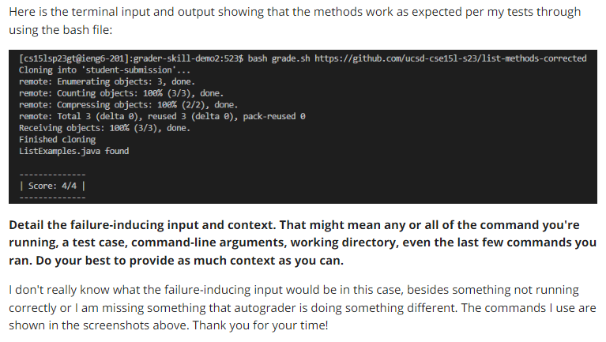
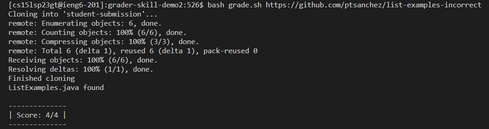

# Lab Report 5

## Part 1

**Original Post:**




**Response from a TA**


**Student Actions Following Response from TA**



_As seen in the above screenshot, the incorrect implementation provided by the TA appears to be running and passing all of the tests successfully. This is a concern, considering the fact that the bash grading script should obviously fail on bad implementations of the method. Even though there is a bug located in the given repository, the grading script falsely passes all of the tests which should not be the case._

# Information about Setup

**File Structure**


**Contents of grade.sh**


**Contents of TestListExamples.java before fix**


<br>
<br>
<br>
<br>
<br>
In order to fix the bug and have the student pass their assignment, there needs to be another test implemented that catches a particular bug that is in the bad implementation. In the contents of the bad implementation, the program incorrectly handled instances where the two elements being compared are exactly the same. In a correct implementation, when two lists being merged have the same exact element and are being compared at the same time both elements should be added to the new list. This is not being tested. If another test were written in TestListExamples.java, this would clear up this issue. The command line command to run the script is:

```
$ bash grade.sh <github_repository_link>
```

## Part 2

One of the cool things that I learned this quarter in the second half of CSE15L labs were the use of GitHub and its applications to many facets of programming. GitHub has been something that I knew about, but was intimidated by. Previously, just looking at the UI was sort of confusing at times, but the labs continued to use and reinforce my abilities of GitHub. This is also relevant to my ability to use the command line, as the labs better familiarized myself to the utilizations of such. GitHub, the command line, and many additional skills that I learned in this class were extremely interesting to see and test with, as this class provided the groundwork to further enhance these abilities that I am sure to make use of in future classes and beyond.
