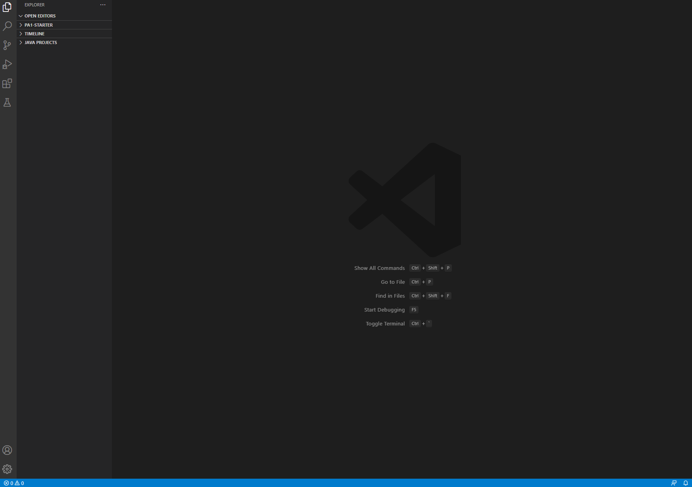

# How to Use Remote Access in CSE15L

## Downloading VSCode
One of the preliminary skillsets of this course is to use remote access in the terminal so that you can utilize the resources of an external computer other than your own. In order to do this, the very first step to set-up this process is to install VScode on your own device. VSCode is a popular programming IDE where we will use the terminal to connect via remote access. 

Download the correct version of VScode according to your computer's operating system at the following link: https://code.visualstudio.com/. Upon downloading and opening the application, you should be prompted with a similiar looking screen as well as welcome messages.

*Note: Depending on your system preferences, VScode may appear as white or dark mode. I set VScode to be in dark mode, but as long as VScode has a similar layout, you are all set up with VScode.*

## Setting up your UCSD CSE15L account
The next step is to reset your password on your own CSE15L account given to you by UCSD. The following process can be access at: https://sdacs.ucsd.edu/~icc/index.php
Put in your UCSD username (the first part of your UCSD email) and PID. You will be prompted with an "Account Lookuip Results" page, where you will want to find your cs15l account. For instance, mine was listed under Additional Accounts. This will show you your username. **Be sure to take note of your username.** Under your listed username, click the button under to reset your account password. Since this is the first time you are using this account, you need to make a password. 

**Note: This username and password are seperate from your TritonLink account. When entering in the username of the account to resest your password, ensure that you use your cs15l account and NOT your TritonLink username.**
